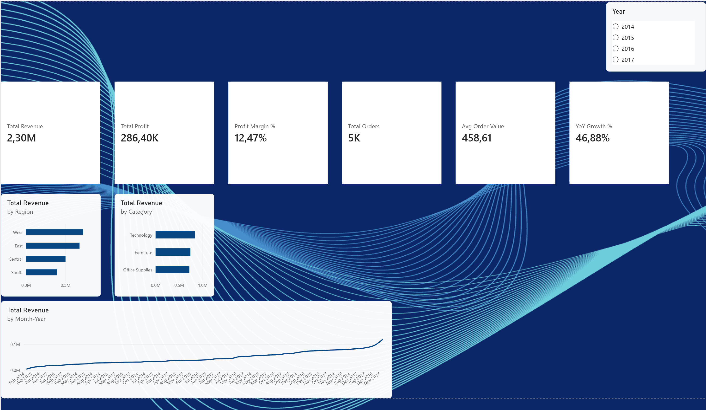
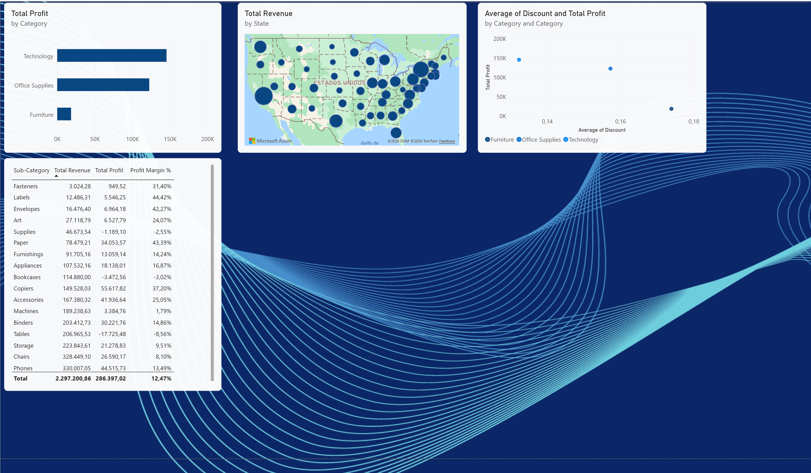
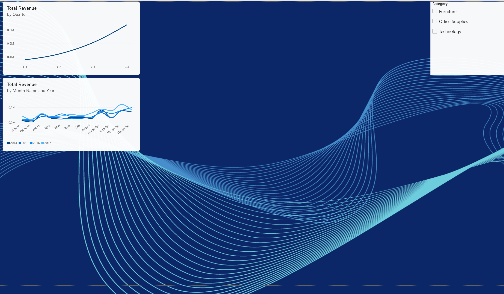

# Sales Performance Dashboard — Power BI

## Overview
Interactive sales dashboard analyzing 9,994 orders from a retail superstore (2014–2017). 
Built to identify revenue trends, regional performance, and profit margin opportunities 
across product categories.

## Screenshots

### Executive Summary

### Category & Region Analysis

### Trends

## Key Insights
- **West region** leads in total revenue ($725K), representing 31% of total sales
- **Technology** generates the highest profit margin (17.4%) vs Furniture (2.5%)
- **Tables and Bookcases** have negative profit margins — pricing strategy needs review
- **Q4 seasonality** is consistent across all years — peak sales in November/December
- Higher discounts correlate directly with lower profit — discount > 20% destroys margin

## Technical Details
| Item | Detail |
|------|--------|
| Dataset | Sample Superstore (Kaggle) |
| Records | 9,994 orders |
| Period | January 2014 – December 2017 |
| Tool | Power BI Desktop |

## DAX Measures
- `Total Revenue` — SUM of Sales
- `Total Profit` — SUM of Profit  
- `Profit Margin %` — DIVIDE(Profit, Revenue)
- `Total Orders` — DISTINCTCOUNT of Order ID
- `Avg Order Value` — Revenue / Orders
- `Revenue PY` — SAMEPERIODLASTYEAR comparison
- `YoY Growth %` — Year-over-year revenue growth (46.88%)

## Skills Demonstrated
`Power BI` `DAX` `Power Query` `Data Modeling` `Data Visualization` `Business Intelligence`

## How to Open
1. Download `sales_dashboard.pbix`
2. Open with Power BI Desktop (free)
3. Use year and category slicers to filter all visuals interactively
